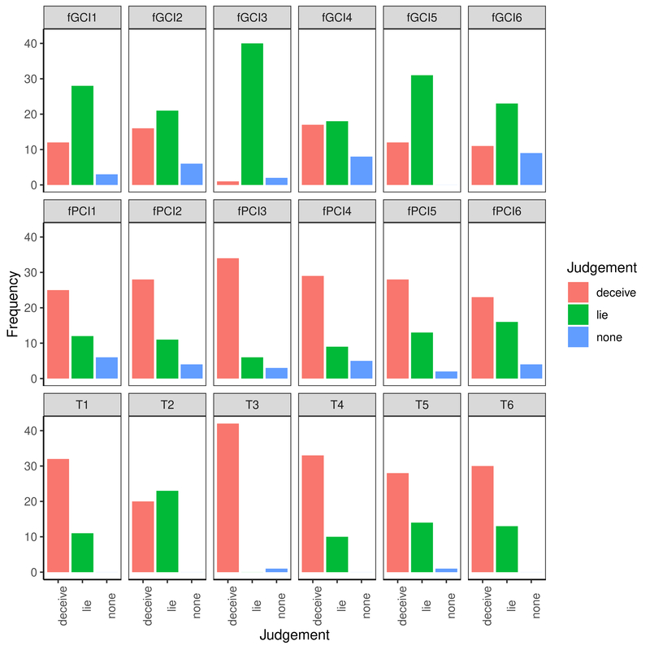
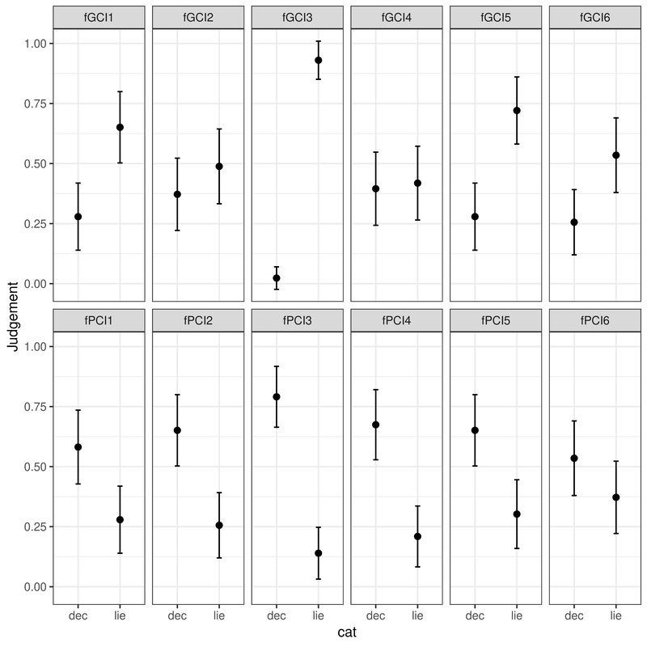
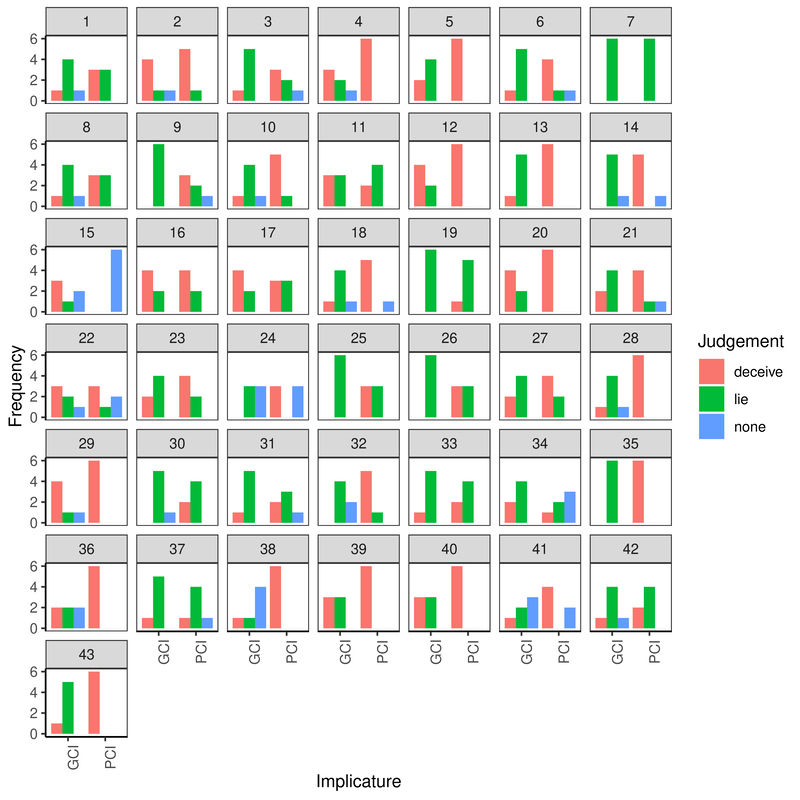
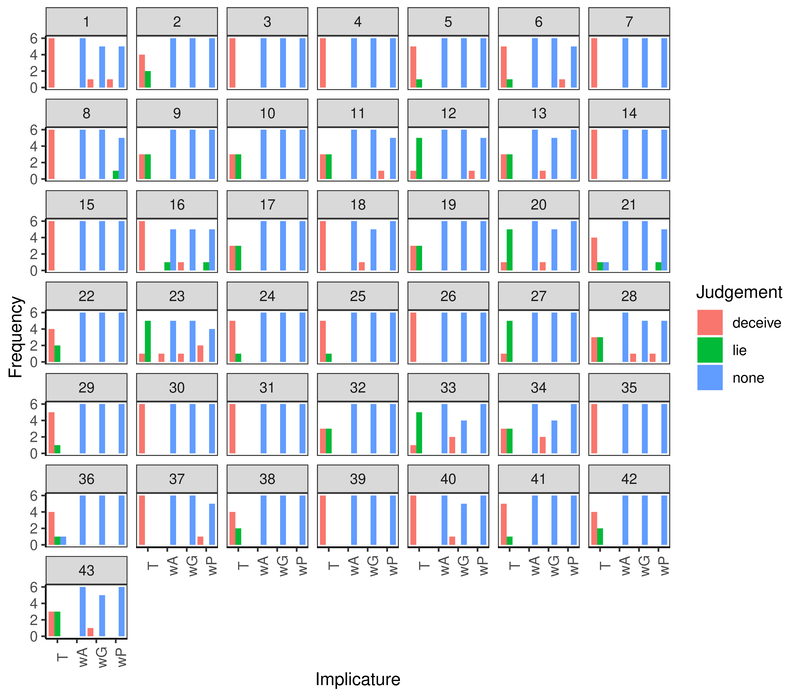
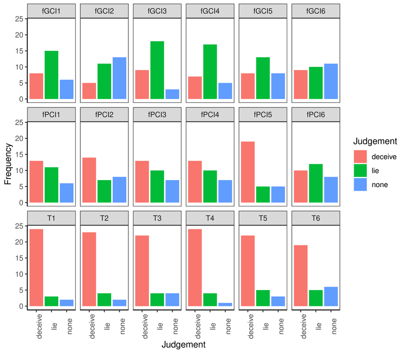
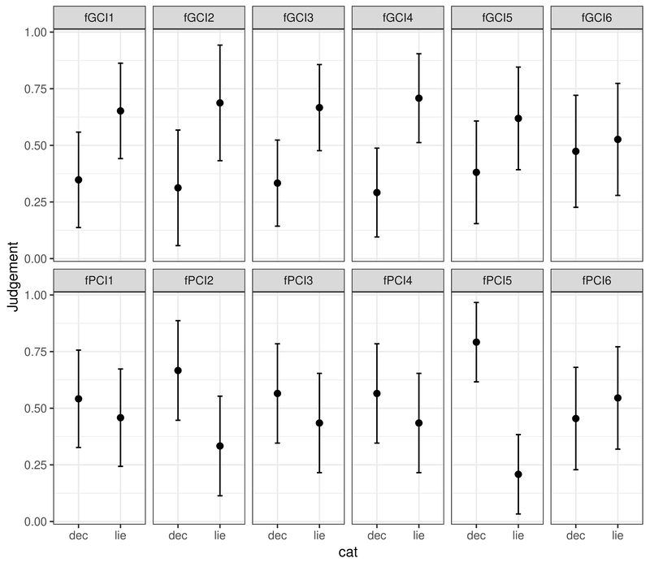
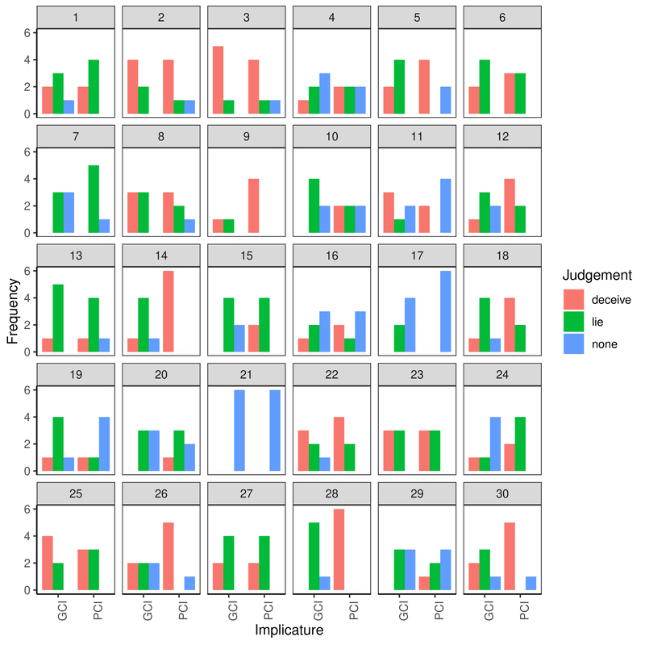
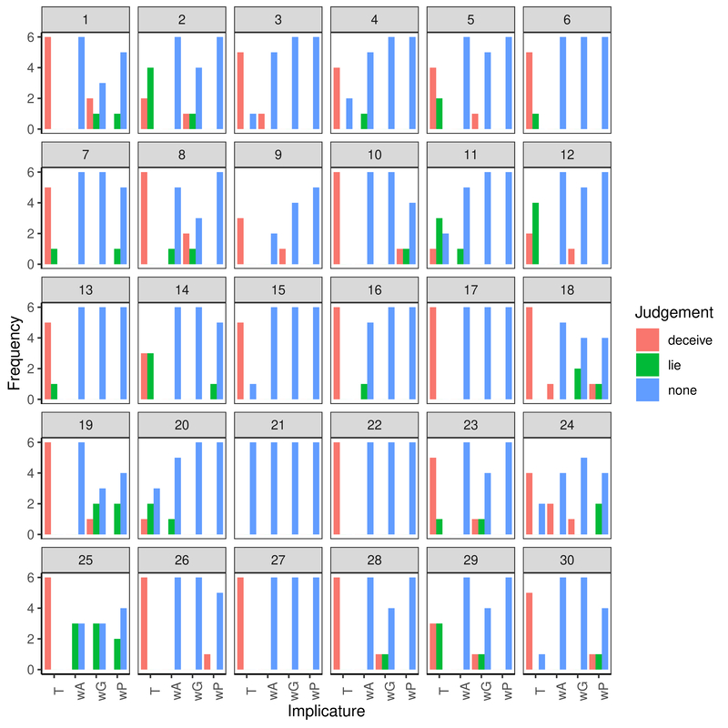
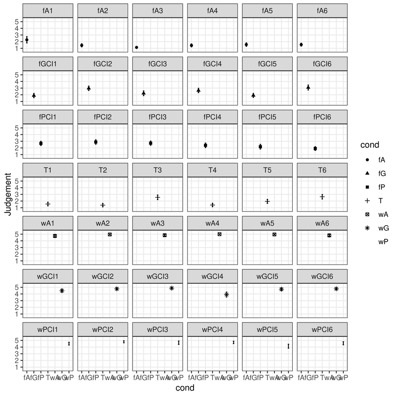
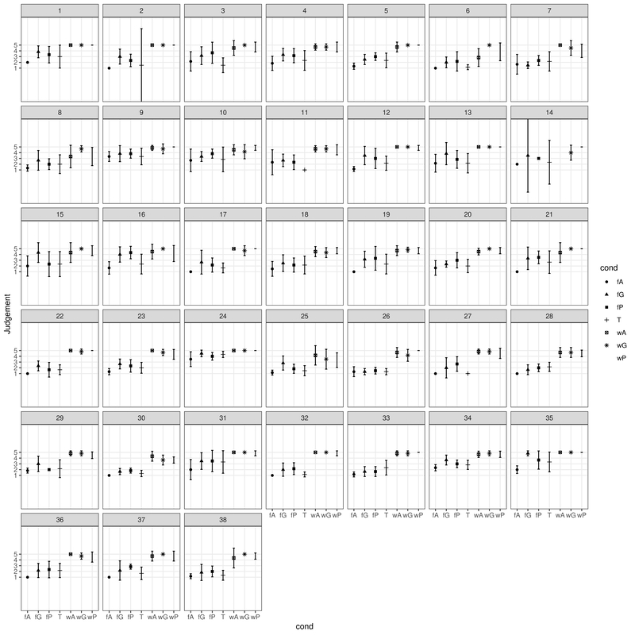

# Thalmann/Chen/Müller/Paluch/Antomo 2020 Supplementary Materials

Thalmann, Maik, Yuqiu Chen, Susanne Müller, Markus Paluch & Mailin Antomo. 2020. Against PCI-GCI uniformity: Evidence from deceptive
language in German and Chinese. *Linguistische Berichte* XX.

## Abstract

> The discussion on whether some conversational implicatures (CIs) are more ‘default’ than the other
> has taken place for a long time. While neo-Griceans (NG) insist on the distinction between
> generalized and particularized CIs which are said to differ along numerous dimensions, so far,
> most studies focusing on computational speed showed any enrichment is more costly than the literal
> understanding, and therefore challenge the distinction between PCIs and GCIs. In this study, a
> novel approach – deceptive language with false implicatures – was used to test speakers of German
> and Mandarin Chinese. The main findings show that (i) false GCIs resemble verbal utterances and
> thus correspond to lies, while PCIs are congruent with non-linguistic deceptions based on actions.
> We argue that this observation, in opposition to most previous experiments investigating the
> GCI-PCI complex, supports the theoretical distinction made by NG. (ii) The response behavior of
> German and Chinese participants seems to be very similar when socio-cultural factors are
> controlled for, suggesting that this pattern is mandated linguistically. Furthermore, two control
> experiments reveal that the patterns observed are not due to moral judgments but that they were
> caused by a genuine linguistic distinction. 

## Experiments 1 and 2: Classification Task

### Experiment 1: German Participants

### Experiment 2: Chinese Participants

## Experiments 3 and 4: Moral Judgments

## Experiment 3: German Participants

## Experiment 4: Chinese Participants

