# Thalmann/Chen/Müller/Paluch/Antomo 2021 Supplementary Materials

Thalmann, Maik, Yuqiu Chen, Susanne Müller, Markus Paluch & Mailin Antomo. 2021. Against PCI-GCI uniformity: Evidence from deceptive
language in German and Chinese. *Linguistische Berichte* 267.

## Abstract

> The discussion on whether some conversational implicatures (CIs) are more ‘default’ than the other
> has taken place for a long time. While neo-Griceans (NG) insist on the distinction between
> generalized and particularized CIs, which are said to differ along numerous dimensions, so far,
> most studies focusing on computational speed showed any enrichment is more costly than the literal
> understanding, and therefore challenge the distinction between PCIs and GCIs. In this study, a
> novel approach – deceptive language with false implicatures – was used to test speakers of German
> and Mandarin Chinese. The main findings show that (i) false GCIs resemble verbal utterances and
> thus correspond to lies, while PCIs are congruent with non-linguistic deceptions based on actions.
> We argue that this observation, in opposition to most previous experiments investigating the
> GCI-PCI complex, supports the theoretical distinction made by NG. (ii) The response behavior of
> German and Chinese participants seems to be very similar when socio-cultural factors are
> controlled for, suggesting that this pattern is mandated linguistically. Furthermore, two control
> experiments reveal that the patterns observed are not due to moral judgments but that they were
> caused by a genuine linguistic distinction. 

## Item List

Note that the untruthful assertions were only used in Experiments III and IV.

<table>
<thead>
<tr class="header">
<th></th>
<th>
<strong>Assertion, truthful</strong>

<strong>German</strong>
</th>
<th><strong>Mandarin Chinese</strong></th>
</tr>
</thead>
<tbody>
<tr class="odd">
<td>
<strong>wA1 
</strong>

<strong> 
</strong>
</td>
<td>Karla und Frida sitzen in Karlas Zimmer und trinken Limonade. Karla sagt: „Ich hole uns schnell ein paar Kekse" und verlässt den Raum. Durch die geöffnete Tür huscht die Katze Minka herein und hüpft auf Fridas Schoß. Dabei stößt sie mit dem Schwanz Karlas Glas vom Tisch. Karla kommt mit den Keksen wieder herein und fragt: „Wer hat denn meine Limonade verschüttet?“ Frida antwortet: „Minka hat das Glas umgestoßen.“</td>
<td>小红和小芳坐在小红的房间里喝汽水。小红说：“我去拿点饼干来”，并离开了房间。小猫喵喵趁门开着溜了进来，跳上了小芳的膝盖，尾巴把小红的杯子从桌上打翻了。小红拿着饼干回来，问道：“谁把我的汽水打翻了？”小芳答道：“喵喵打翻了杯子。</td>
</tr>
<tr class="even">
<td><strong>wA2 
</strong></td>
<td>Paul und Otto sind zum Spielen verabredet. Als Otto gerade nicht im Zimmer ist, kommt Pauls Hund Fido herein. Er frisst Ottos Lieblingskekse auf. Otto kommt ins Zimmer zurück und fragt: „Oh nein, wer war denn das?“ Paul sagt: „Fido hat die Kekse gefressen.“</td>
<td>小明和小强约好一起玩。小强不在房间的时候，小明的狗汪汪跑了进来。它吃光了小强最喜欢的饼干。小强回到房间，问道：“我去，谁干的？”小明说：“汪汪把饼干吃掉了。”</td>
</tr>
<tr class="odd">
<td><strong>wA3</strong></td>
<td>Frida ist bei Karla zu Besuch und die beiden malen mit Wasserfarben. Als Frida kurz das Kinderzimmer verlässt, kommt die Katze Minka herein. Sie läuft über Fridas Bild und verwischt dabei einige Farben. Dann läuft sie wieder aus dem Zimmer. Als Frida wiederkommt, sieht sie ihr verwischtes Bild und fragt: „Wie ist denn das passiert?“ Karla antwortet: „Minka ist über das Bild gelaufen und hat die Farben verwischt.“</td>
<td>小芳去小红家玩，俩人一起用水彩画画。在小芳暂时离开房间的时候，小猫喵喵走了进来。它从小芳的画上跑了过去，弄糊了画上的一些颜色，然后离开了房间。小芳回来后看到了糊了的画，问道：“刚刚发生了什么？”小红说：“喵喵从画上跑了过去并弄糊了颜色。”</td>
</tr>
<tr class="even">
<td><strong>wA4 
 
 
</strong></td>
<td>Paul und Otto wollen in den Garten, um Ball zu spielen. Sie ziehen die Schuhe an und gehen raus. Dabei vergisst Otto, den Ball mitzunehmen. Draußen fragt Paul: „Wo ist denn der Ball?” Otto antwortet: „Mist, ich habe ihn im Haus vergessen.“</td>
<td>小明和小强想去花园里玩球。他们穿好鞋走出门时，小强却忘了带上球。到外面后小明问道：“球呢？”小强答道：“我去，我把它忘家里了。”</td>
</tr>
<tr class="odd">
<td><strong>wA5</strong></td>
<td>Karla darf mit Fridas Lego spielen, während Frida im Garten ist. Nachdem Karla einige Zeit damit gespielt hat, legt sie die Legosteine zurück in die Kiste und geht zu Frida nach draußen. Frida fragt: „Hast du meine Legosteine zurückgelegt?“ Karla antwortet: „Ja, ich habe sie wieder in die Kiste geräumt.“</td>
<td>小芳在花园里的时候，小红在玩她的乐高积木。玩了一会后，小红把积木放回原处，然后去找小芳。小芳问：“你把我的乐高积木放回原处了吗？”小红说：“是的，我把它们收回箱子里了。”</td>
</tr>
<tr class="even">
<td><strong>wA6</strong></td>
<td>Paul sitzt in der Badewanne. Plötzlich kommt sein Hund Fido ins Bad und springt zu ihm in die Wanne. Dabei schwappt viel Wasser auf den Badezimmerboden. Nach dieser Erfrischung läuft Fido wieder weg. Pauls Mutter kommt ins Bad und fragt ihn: „Wieso ist denn der Boden so nass?” Paul antwortet: „Fido ist eben zu mir in die Badewanne gesprungen. Dabei ist das Wasser über die Wanne geschwappt.“</td>
<td>小明坐在浴缸里洗澡，突然他的狗汪汪进了浴室并跳进缸里，很多水泼到了浴室的地上。汪汪凉爽了一番以后又跑出去了。小明的妈妈走进浴室并问他：“怎么地上这么潮？”小明说：“汪汪刚刚跳进了浴缸，水就漫出去了。”</td>
</tr>
<tr class="odd">
<td></td>
<td><strong>Assertion, untruthful</strong></td>
<td></td>
</tr>
<tr class="even">
<td><strong>fA1</strong></td>
<td>Charlotte und Luisa sitzen in Charlottes Zimmer und trinken Saft. Charlotte sagt: „Ich hole uns schnell ein paar Kekse." und verlässt den Raum. Durch die geöffnete Tür huscht die Katze Minka herein und hüpft auf den Tisch. Luisa will die Katze streicheln und stößt dabei Charlottes Saftglas um. Charlotte kommt mit den Keksen zurück und fragt: „Wer hat denn meinen Saft verschüttet?". Luisa antwortet: „Minka hat das Glas umgestoßen."</td>
<td>小红和小芳坐在小红的房间里喝汽水。小红说：“我去拿点饼干来”，并离开了房间。小猫喵喵从打开的门里溜了进来并跳上了桌子，小芳想摸摸喵喵，却把小红的玻璃杯从桌上打翻下去。小红拿着饼干回来并问道：“谁把我的汽水洒了？”小芳答道：“喵喵打翻了杯子。”</td>
</tr>
<tr class="odd">
<td><strong>fA2</strong></td>
<td>Otto und Paul sind zum Spielen verabredet. Als Paul gerade nicht im Zimmer ist, fällt Otto aus Versehen Pauls Fußballpokal herunter. Pauls Hund Fido kommt ins Zimmer und kurz darauf auch Paul. Er fragt: „Oh nein, wer war das denn?". Otto sagt: „Fido hat den Pokal heruntergeworfen."</td>
<td>小明和小强约好一起玩。小强不在房间的时候，小明不小心打翻了小强的足球奖杯。小强的狗汪汪跑进房间，一会儿后小强也进来了。他问道：“我去，谁干的？”小明说：“汪汪打翻了奖杯。”</td>
</tr>
<tr class="even">
<td><strong>fA3</strong></td>
<td>Charlotte bringt ihr neues Springseil mit in den Kindergarten und zeigt es ihrer Freundin Luisa. Luisa sagt daraufhin zu ihr: „Wow, so eins hätte ich auch gerne!" Kurz darauf, als Charlotte ihre Jacke aus dem Flur holt, steckt Luisa das Springseil heimlich ein. Als Charlotte wiederkommt, fragt sie Luisa: „Wo ist denn mein Springseil?" Luisa antwortet: „Ich habe es nicht weggenommen.”</td>
<td>小芳带着她的新跳绳来到了幼儿园并把它展示给她的朋友小红看。对此，小红表示：“哇，我也想要这么一根跳绳！”一会之后，小芳去走廊上拿外套，这时小红悄悄把那根跳绳放进了衣袋。小芳回来后问小红：“我的跳绳呢？”小红回答道：“我没拿它。”</td>
</tr>
<tr class="odd">
<td><strong>fA4</strong></td>
<td>Otto ist bei Paul zu Besuch. Auf dem Tisch liegt Pauls neues Malbuch. Als Paul das Zimmer verlässt, fängt Otto an, auf der ersten Seite des Malbuchs ein Schwein auszumalen. Otto hört, dass Paul wiederkommt und legt schnell den Stift zur Seite. Paul sieht sofort, dass in dem Buch etwas ausgemalt ist. Wütend fragt Paul: „Hast du das Schwein ausgemalt?“ Otto antwortet: „Nein, das war schon so.“</td>
<td>小强在小明家玩，桌上放着小明新的画画本。在小明离开房间的时候，小强在这本画画本的第一页画了一只猪。小强听见小明回来了，就把画画本放到一边。小明马上发现画画本被涂画了，他愤怒地问：“这猪是你画的嘛？”小强说：“不是，这是本来就有的”</td>
</tr>
<tr class="even">
<td><strong>fA5</strong></td>
<td>Charlotte und Luisa malen. Charlotte geht kurz aus dem Raum, um für die beiden etwas zu trinken zu holen. Luisa gefällt Charlottes roter Stift besser als ihr eigener und sie malt damit weiter. Dabei bricht die Mine ab. Als Charlotte wiederkommt, fragt sie: „Was ist denn mit meinem Buntstift passiert?“. Luisa antwortet: „Die Katze ist draufgetreten.“</td>
<td>小芳和小红在画画。小芳离开房间一小会去给俩人拿点喝的。小红喜欢小芳的红笔超过自己的，就用小芳的接着画起来。中途笔芯断了。小芳回来并问道：“我的彩笔怎么啦？”小红回答道：“喵喵踩的”</td>
</tr>
<tr class="odd">
<td><strong>fA6</strong></td>
<td>
Otto und Paul essen Schokokekse. Otto zeigt Paul seine neuen weißen Schuhe, dann geht er auf

die Toilette. Paul möchte sich die Schuhe noch einmal genauer angucken. Er fasst die Schuhe mit

seinen verschmierten Schokoladenfingern an, sodass ein Fleck auf den weißen Schuhen entsteht.

Erschrocken stellt er die Schuhe wieder zurück an ihren Platz. Als Otto zurückkommt, sieht er den

Fleck auf den Schuhen und fragt: „Was hast du denn mit meinen Schuhen gemacht?" Paul antwortet: „Die

waren schon so."
</td>
<td>小强和小明一起吃巧克力，小强给小明展示了一下他新的小白鞋，然后去了洗手间。小明还想再仔细看看小强的新鞋，他用沾了巧克力的手拿起了鞋，导致白鞋染上了污渍。小明吓了一跳并把鞋子放回了原位。小强回来并看到了鞋子上的污渍，他问：“你对我的鞋做了什么？”小明说：“之前就是这样了。”</td>
</tr>
<tr class="odd">
<td></td>
<td><strong>PCI, truthful</strong></td>
<td></td>
</tr>
<tr class="even">
<td><strong>wPCI1</strong></td>
<td>Paul und Otto sitzen in der Küche. Sie haben jeweils einen Teller mit einem großen Stück Kuchen vor sich. Paul sagt: „Ich muss mal auf die Toilette.” Er verlässt die Küche. In der Zeit kommt Fido, der Hund, herein, schnappt sich Pauls Kuchen und läuft weg. Als Paul zurückkommt, fragt er: „Wo ist denn mein Kuchen?“ Otto antwortet: „Fido war eben hier.“</td>
<td>小明和小强坐在厨房里，每人面前的盘子里都有一大块蛋糕。小明说：“我得去下卫生间。”然后他就离开了厨房。这时他的狗汪汪溜了进来，叼走了他的蛋糕，然后又跑出去了。小明回来后问道：“我的蛋糕呢？”小强答道：“汪汪刚刚在这。”</td>
</tr>
<tr class="odd">
<td><strong>wPCI2</strong></td>
<td>Beim Kinderturnen fällt Paul von der Kletterwand und verletzt sich den Fuß. Weil ihm der Fuß so weh tut, setzt er sich auf die Bank. Otto sieht ihn auf der Bank sitzen und fragt: „Warum machst du denn nicht mehr mit?”. Paul antwortet: „Ich bin von der Kletterwand gefallen.”</td>
<td>在儿童体育课上，小明从攀岩墙上摔了下来并伤到了脚。由于脚很痛，他坐在了长椅上。小强看他坐在那，问道：“你怎么不继续了？”小明回答：“我从攀岩墙上摔下来了。”</td>
</tr>
<tr class="even">
<td><strong>wPCI3</strong></td>
<td>Frida und Karla spielen zusammen in Karlas Garten im Sandkasten. Frida hat eine große Sandburg gebaut und Karla einen Tunnel. Frida geht kurz ins Haus, um etwas zu trinken. Während sie weg ist, springt Karlas Katze Minka in den Sandkasten und macht dabei Fridas Sandburg kaputt. Danach läuft sie zurück ins Haus. Als Frida zurückkommt, fragt sie: „Wer hat denn meine Sandburg kaputt gemacht?“ Karla antwortet: „Minka war im Sandkasten, als du im Haus warst.”</td>
<td>小芳和小红一起在小红家花园的沙坑里玩沙子。小芳堆了一座大沙堡，小红挖了一条隧道。就在小芳进屋去喝水的时候，小红的猫喵喵跳进了沙坑并弄坏了小芳的沙堡，然后又跑回房间。小芳回来后问道：“谁把我的沙堡弄坏了？”小红说：“你在室内的时候，喵喵在沙坑里。”</td>
</tr>
<tr class="odd">
<td><strong>wPCI4</strong></td>
<td>Otto kauft sich am Kiosk neben der Schule einen Lolli. Mit dem Lolli im Mund trifft er an der nächsten Straßenecke Paul. Paul sagt: „Ich möchte auch so einen Lolli haben!“ Otto antwortet: „Neben der Schule gibt es einen Kiosk.”</td>
<td>小强在学校边上的杂货亭里买了一支棒棒糖。正吃着糖的他在下一个街角遇到了小明。小明说：“我也想要一个这样的棒棒糖！”小强说：“学校旁边有个杂货亭。”</td>
</tr>
<tr class="even">
<td><strong>wPCI5</strong></td>
<td>Karla und Frida sind heute bei Frida zum Spielen verabredet. Fridas Mutter öffnet Karla die Tür. Sie trägt einen vollen Wäschekorb. Ganz oben auf dem Wäschekorb erkennt Karla Fridas grünen Lieblingspulli. Später sucht Frida im ganzen Haus nach dem Pulli. Sie fragt Karla „Hast du meinen grünen Pulli gesehen?“ Karla antwortet: „Deine Mutter hat gerade Wäsche angestellt.“</td>
<td>小红和小芳今天约在小芳家玩。小芳的妈妈给小红开门的时候，手里还拿着一个满满的脏衣篮。小红认出脏衣篮最上面的是小芳最喜欢的那件绿色毛衣。之后小芳满屋子找那件毛衣，她问小红：“你看到我那件绿毛衣没有？”小红说：“你妈妈刚刚去洗衣服了。”</td>
</tr>
<tr class="odd">
<td><strong>wPCI6</strong></td>
<td>Karla schneidet sich beim Apfelschälen mit dem Messer in den Finger. Es blutet etwas und ihre Mutter verarztet sie mit einem Pflaster. Später kommt Frida zu Besuch. Als Frida das Pflaster an Karlas Finger sieht, fragt sie: „Hast du dich verletzt?“ Karla antwortet: „Ich wollte einen Apfel schälen.“</td>
<td>小红削苹果的时候切到了手指，流了点血，她妈妈给她贴了个创口贴。之后小芳来她家玩，她看到小红手指上的创口贴，问道：“你受伤了？”小红答道：“我刚刚想削个苹果。”</td>
</tr>
<tr class="even">
<td></td>
<td><strong>GCI, truthful</strong></td>
<td></td>
</tr>
<tr class="odd">
<td><strong>wGCI1</strong></td>
<td>Karla verkauft im Sommer vor ihrem Haus selbst gebackenen Kuchen. Am Ende des Tages hat sie noch ein paar Stücke übrig. Karla bringt die restlichen Kuchenstücke zurück ins Haus. Als sie wieder rauskommt, kommt Frida vorbei und fragt: „Hast du alle Stücke verkauft?” Karla antwortet: „Ich habe einige verkauft!”</td>
<td>小红夏天的时候在家门口卖自制蛋糕。这天傍晚蛋糕还剩了几块，她把这剩下的几块都拿回了家里。当她再出来的时候，小芳正好路过并问道：“你把所有蛋糕都卖掉了？”小红说：“我卖掉了一些！”</td>
</tr>
<tr class="even">
<td><strong>wGCI2</strong></td>
<td>Paul übt für einen Schwimmwettbewerb. Dazu gehört auch, dass er einen roten Ring vom Beckenboden hochholen muss. Einige Male hat es Paul schon geschafft, den Ring hochzuholen, aber oft klappt es auch noch nicht. Sein Freund Otto fragt: „Und? Klappt das mit dem Ring?“. Paul antwortet: „Manchmal kann ich ihn raufholen.“</td>
<td>小明在为游泳比赛做准备，练习项目中包括从泳池底部捞起一只红色圆环。他捞起过几次圆环，但并不能每次都成功。他的朋友小强问他：“你捞圆环捞得起来嘛？”小明说：“我偶尔能捞起来。”</td>
</tr>
<tr class="odd">
<td><strong>wGCI3</strong></td>
<td>Otto nimmt an einem Wettrennen teil. Er strengt sich zwar sehr an, gewinnt aber leider nicht. Am nächsten Tag fragt ihn sein Freund Paul: „Und, wie ist das Wettrennen gelaufen? Hast du gewonnen?“ Otto antwortet: „Ich habe es versucht.“</td>
<td>小强参加了赛跑，虽然他尽力了，但是并没有获胜。第二天他的朋友小明问他：“比赛怎么样？你获胜了吗？”小强说：“我尝试了。”</td>
</tr>
<tr class="even">
<td><strong>wGCI4</strong></td>
<td>Ottos Eltern haben zwei Pudel und zwei Schäferhunde. Otto soll die Hunde füttern. Weil er aber Angst vor den Schäferhunden hat, füttert er nur die Pudel. Später fragt ihn seine Mutter: „Otto, hast du die Hunde gefüttert?" Otto antwortet: „Ich habe die Pudel gefüttert."</td>
<td>小强的父母养了两只卷毛狗和两只狼狗，小强得给它们喂食。由于他害怕狼狗，所以他只给卷毛狗喂了食。之后他妈妈问他：“小强，你给狗喂食了吗？”小强说：“我给卷毛狗喂食了。”</td>
</tr>
<tr class="odd">
<td><strong>wGCI5</strong></td>
<td>Otto bringt für alle Kinder im Kindergarten Gummibärchen mit. Alle Kinder freuen sich über die Süßigkeiten, nur Karla nicht, da sie keine Gummibärchen mag. Als Ottos Mutter ihn vom Kindergarten abholt, fragt sie. „Haben allen Kindern die Süßigkeiten geschmeckt?" Otto antwortet: „Die meisten Kinder mochten die Gummibärchen."</td>
<td>小强给幼儿园的所有小朋友带了小熊糖。所有小朋友都非常开心，除了小红，因为她不喜欢小熊糖。小强的妈妈来幼儿园接他的时候问道：“所有的小朋友都喜欢糖吗？”小强说：“绝大部分小朋友喜欢小熊糖。”</td>
</tr>
<tr class="even">
<td><strong>wGCI6</strong></td>
<td>Peter und Maria fahren in den Urlaub ans Meer. Obwohl eigentlich ein Sturm vorausgesagt war, war es nur windig. Als sie wieder zuhause sind, treffen sie auf ihren Freund Karl. Karl fragt: „Wie war das Wetter während eures Urlaubs? Ich habe gehört, dass ein Sturm vorhergesagt war." Peter antwortet: „Es war windig."</td>
<td>张伟和李娟去海边度假。虽然天气预报说会有风暴，但其实只是普通的风而已。他们到家后遇到了朋友王磊，王磊问：“你们度假的时候天气怎么样？我听预报说有风暴。”张伟说：“有风。”</td>
</tr>
<tr class="odd">
<td></td>
<td><strong>Deception</strong></td>
<td></td>
</tr>
<tr class="even">
<td><strong>T1</strong></td>
<td>Paul hat Heißhunger und isst alle Kekse aus dem Süßigkeitenfach in der Küche auf. Damit seine Eltern nicht merken, dass er es war, der die Kekse gegessen hat, verteilt er einige Krümel im Körbchen von seinem Hund Fido. Später sieht er, wie seine Mutter mit Fido schimpft.</td>
<td>小明特别饿，吃掉了厨房的甜点盒里的所有饼干。为了不让他父母发现是他吃了饼干，他把一些碎屑撒在了小狗汪汪的狗窝里。之后，他看到他妈妈在责骂汪汪。</td>
</tr>
<tr class="odd">
<td><strong>T2</strong></td>
<td>Maria bewirbt sich um ein Volontariat bei einer bekannten Zeitung. In der Stellenausschreibung steht, dass ein Studienabschluss mit der Note 1 Bewerbungsvoraussetzung ist. Maria hat ihren Master aber mit der Note 2 abgeschlossen. Für ihre Bewerbungsunterlagen erstellt sie eine Kopie ihres Masterzeugnisses und ändert dabei die Note 2 in eine 1. Eine Woche später erhält sie einen Brief, in dem sie zum Vorstellungsgespräch bei der Zeitung eingeladen wird.</td>
<td>李娟在申请一家著名报纸的实习职位。在职位说明中写道，申请者的毕业成绩应高于90分，而李娟的硕士毕业成绩只有80分。在申请材料中她制作了一份硕士成绩复印件并把成绩从80分改成了90分。一周后她收到这家报纸的面试邀请。</td>
</tr>
<tr class="even">
<td><strong>T3</strong></td>
<td>Karla hat Geburtstag. Auf dem Tisch stehen Muffins und Kuchen und gleich kommen die Kinder, die Karla eingeladen hat. Karlas Mutter hat Kakao vorbereitet, den sie in einer Kanne auf den Tisch stellt. Daneben stellt sie einen Zuckerstreuer, damit der Kakao bei Bedarf noch gesüßt werden kann. Karla möchte ihren Gästen einen Streich spielen und füllt Salz in den Zuckerstreuer. Später, als alle da sind, greift Frida nach dem Zuckerstreuer und würzt damit ihren Kakao.</td>
<td>小红今天过生日。桌上已经摆上了蛋糕和点心，她邀请的小朋友们马上也要来了。小红的妈妈泡了一壶可可，把它放在了桌上，并在它旁边放了一个小糖罐，以便客人可以根据喜好加糖。小红想开个玩笑，用盐装满了糖罐。之后大家都到了，小芳拿起了糖罐，用它来给自己的可可调味。</td>
</tr>
<tr class="odd">
<td><strong>T4</strong></td>
<td>Peter nimmt an einem Wettrennen im Park teil. Die gelb markierte Strecke geht einmal außen um den Park herum. Schnell haben die anderen Läufer ihn abgehängt und er ist der letzte. Da sieht er einen schmalen Trampelpfad, der quer durch den Park verläuft. Peter sieht sich schnell um und als er merkt, dass ihn niemand beobachtet, nimmt er den Trampelpfad, um die Strecke abzukürzen. Kurz vor dem Ziel mündet der Trampelpfad auf der gelb markierten Strecke und Peter gewinnt das Wettrennen.</td>
<td>张伟参加了一个公园里的跑步比赛，黄色标识的跑步路径从外面绕了公园一圈。其他参与者很快甩掉了张伟，他成了最后一个。这时他注意到有一条横穿公园的小路。他见四下无人，就 抄小路走了捷径。在终点不远处，小路和标黄的赛道重合了，张伟赢了比赛。</td>
</tr>
<tr class="even">
<td><strong>T5</strong></td>
<td>Peter und Maria sind sich uneinig, wo sie ihren Sommerurlaub verbringen sollen. Er möchte eine Wanderung in den Bergen machen, sie möchte lieber ans Meer fahren. Als der Sommer immer näher rückt, tut Maria so, als hätte sie Knieschmerzen, um den Eindruck zu vermitteln, dass sie nicht wandern kann. Daraufhin entscheidet Peter, dass sie lieber ans Meer fahren sollten.</td>
<td>张伟和李娟对他们去哪里过暑假有分歧。他想去爬山，而她想去海边。随着夏天渐渐到来，李娟表现出膝盖疼痛的样子，从而给人她不能爬山的印象。张伟因此决定他们还是去海边。</td>
</tr>
<tr class="odd">
<td><strong>T6</strong></td>
<td>Peter und Maria haben sich gestritten. Sie wirft ihm vor, dass er nie kocht. Am nächsten Tag kauft Peter nach der Arbeit beim Italiener Nudeln mit Krabbensoße. Zuhause füllt er die Nudeln in eine Pfanne und entsorgt die Verpackungen. Als Maria nach Hause kommt, freut sie sich über das selbst gekochte Essen.</td>
<td>张伟和李娟吵架了，李娟指责他从来不做饭。第二天张伟下班后在意大利菜馆买了蟹汁意面。回家后，他把面条装进锅里并丢掉了包装。李娟回家后很高兴看到这亲手做的饭菜。</td>
</tr>
<tr class="even">
<td></td>
<td><strong>PCI, untruthful</strong></td>
<td></td>
</tr>
<tr class="odd">
<td><strong>fPCI1</strong></td>
<td>Karla und Frida haben eine Hütte aus Zweigen in Karlas Garten gebaut. Karla geht zur Toilette und Frida bleibt bei der Hütte. Auf einmal wird es ganz windig. Frida ist kalt und sie krabbelt in die Hütte. Dabei stößt sie mit dem Kopf gegen das Dach der Hütte, so dass es kaputtgeht. Als Karla wiederkommt, fragt sie entsetzt: „Was ist denn mit dem Dach passiert?“ Frida antwortet: „Es wurde auf einmal ganz windig.“</td>
<td>小红和小芳在小红家的花园里用树枝搭了个小棚。小红去了洗手间，小芳留在小棚边上。突然刮起了大风，小芳觉得很冷并爬进了棚子里。她的头撞到了棚顶并把它弄坏了。小红回来并问道：“这棚顶着怎么了？”小芳说：“刚刚风很大。”</td>
</tr>
<tr class="even">
<td><strong>fPCI2</strong></td>
<td>Im Kindergarten gibt es heute zum Mittagessen Kohlsuppe mit Baguette. Karla isst aber nur das Baguette, weil ihr die Suppe nicht schmeckt. Später wird Karla von ihrer Mutter aus dem Kindergarten abgeholt. Karlas Mutter fragt: „Hast du heute eigentlich schon Gemüse gegessen?” Karla antwortet: „Es gab zum Mittagessen Kohlsuppe.”</td>
<td>今天幼儿园的午餐是包菜浓汤配面包。小红只吃了面包，因为她不太喜欢浓汤。之后她妈妈来幼儿园接她。妈妈问：“你今天吃蔬菜了没有？”小红说：“午餐有包菜浓汤。”</td>
</tr>
<tr class="odd">
<td><strong>fPCI3</strong></td>
<td>Morgens und abends bekommt Otto immer die Zähne von seiner Mutter oder seinem Vater geputzt. Otto hasst Zähneputzen. Es ist spät, gleich soll Otto ins Bett gehen. Zusammen mit seinem Vater ist er im Bad. Sein Vater möchte ihm gerade die Zähne putzen, da klingelt das Telefon. Ottos Vater läuft schnell zum Telefon in den Flur. Otto geht in sein Kinderzimmer, wo seine Mutter schon auf ihn wartet. Sie möchte ihn ins Bett bringen und fragt: „Otto, hat Papa dir schon die Zähne geputzt?“ Otto antwortet: „Wir waren gerade im Bad.“</td>
<td>小强爸妈每天早晚帮他刷牙。小强讨厌刷牙。现在很晚了，小强该睡了。他爸爸和他一起去了浴室，爸爸刚准备给他刷牙，电话响了，爸爸赶紧跑去走廊接电话。小强回了房间，他妈妈已经在那等他了。她打算让他上床睡下，并问：“小强，刚刚爸爸给你刷牙了吗？”小强说：“我们刚刚在浴室。”</td>
</tr>
<tr class="even">
<td><strong>fPCI4</strong></td>
<td>Otto hat Geburtstag und teilt im Kindergarten Schokoriegel aus. Paul isst seinen sofort auf. Als er nach Hause kommt, nimmt er sich einen zweiten Schokoriegel aus der Süßigkeiten-Box in der Küche. Pauls Mutter kommt herein und fragt: „Paul, was ist das denn für ein Schokoriegel in deiner Hand? Hast du wieder Schokolade aus der Süßigkeiten-Box genommen?” Paul antwortet: „Otto hat heute Geburtstag, er hat allen Kindern Schokoriegel mitgebracht.“</td>
<td>小强今天过生日，在幼儿园分发巧克力棒。小明马上把他得到的那根吃掉了。回到家后，小明从厨房的甜食盒子里又拿了一根。小明妈妈走进来并问道：“小明，你手里怎么拿着巧克力棒？你又从甜食盒子里拿巧克力了？”小明答道：“小强今天过生日，他给每个小朋友都带了巧克力棒。”</td>
</tr>
<tr class="odd">
<td><strong>fPCI5</strong></td>
<td>Frida hat heute Geburtstag und einige Kinder zu ihrer Geburtstagsfeier eingeladen. Otto ist nicht eingeladen. Er möchte stattdessen ins Schwimmbad gehen, aber seine Eltern haben es ihm verboten, weil er noch erkältet ist. Als er trotzdem das Haus verlässt, um ins Schwimmbad zu gehen, ruft seine Mutter: „Otto, wohin gehst du?“ Otto antwortet: „Frida feiert heute Geburtstag.“</td>
<td>小芳今天过生日并邀请了一些小朋友来庆祝，小强没有被邀请。他想去游泳，但是他的父母不同意，因为他感冒了。尽管如此，他还是要去游泳。在他离开家时，他妈妈问道：“小强你去哪？”小强答道：“小芳今天过生日。”</td>
</tr>
<tr class="even">
<td><strong>fPCI6</strong></td>
<td>Karla gefällt der neue Glitzerflummi von ihrer Freundin Frida. Als Frida gerade nicht im Zimmer ist, kommt die Katze Minka herein. Sie spielt kurz mit dem Flummi und geht dann in ihr Körbchen in der Küche. Danach spielt Karla noch etwas mit dem Flummi und lässt ihn durch das Zimmer springen. Dabei springt er ihr versehentlich aus dem Fenster und verschwindet in einem tiefen Dornengestrüpp. Als Frida wiederkommt, sucht sie ihren Flummi und fragt: „Karla, weißt du, wo mein neuer Glitzerflummi ist?“ Karla sagt: „Minka hat gerade mit dem Flummi gespielt.“</td>
<td>小红很喜欢她朋友小芳的新弹弹球。小芳不在房间的时候，小猫喵喵跑了进来。它玩了一会弹弹球，然后就去它厨房的窝里了。之后小红又玩了一会弹弹球，让它满屋子弹，一不小心就让它从窗户里弹了出去，消失在长满刺的灌木丛里。小芳回来后想找她的弹弹球，并问道：“小红，你知道我的新弹弹球在哪吗？”小红说：“喵喵刚刚在玩它。”</td>
</tr>
<tr class="odd">
<td></td>
<td><strong>GCI, untruthful</strong></td>
<td></td>
</tr>
<tr class="even">
<td><strong>fGCI1</strong></td>
<td>Die Mathearbeit der Klasse 7a war so schwierig, dass alle Schüler durchgefallen sind. Nachdem sich viele Eltern bei der Schuldirektorin beschwert haben, bittet sie den Mathelehrer der Klasse 7a zu sich ins Büro. Die Schuldirektorin fragt „Jetzt erzählen Sie mir doch nochmal: Wie ist die Mathearbeit denn jetzt ausgefallen?“ Der Mathelehrer antwortet: „Einige Schüler sind durchgefallen.“</td>
<td>初一一班的数学考试太难了，所有学生都没通过。在很多家长向校长反映情况后，她请初一一班的数学老师来谈话。校长说：“现在请您和我说说：这数学考试到底有多难？”数学老师说：“有些学生没有通过。”</td>
</tr>
<tr class="odd">
<td><strong>fGCI2</strong></td>
<td>Otto und Paul sind beide im Fußballverein. Am Wochenende spielen sie gegen den Verein aus dem Nachbarort. Otto schießt viele Tore und wird von allen gelobt, weil er so außergewöhnlich gut spielt. Paul dagegen sitzt fast die ganze Zeit auf der Ersatzbank und ist neidisch auf Otto. Abends beim Essen fragt Pauls Mutter: „Wie hat eigentlich Otto heute gespielt?“ Paul antwortet: „Otto hat ganz ok gespielt.“</td>
<td>小强和小明两个人都在球队踢球。他们周末和隔壁球队有场比赛。小强进了四个球并得到了所有人的夸奖，因为他踢的非常棒。小明却一直坐在场下，他非常嫉妒小强。吃晚饭的时候小明妈妈问：“小强今天踢的怎么样？”小明说：“他踢的还可以。”</td>
</tr>
<tr class="even">
<td><strong>fGCI3</strong></td>
<td>Ottos Mutter will einen Kuchen aus Hefeteig backen. Da sie noch Zucker kaufen muss, bittet sie Otto, den Hefeteig anzurühren. Sie erinnert ihn daran, für den Teig nur warmes, aber kein heißes Wasser zu benutzen, damit die Hefe richtig aufgeht. Dann geht sie zum Supermarkt. Weil Ottos Lieblingsserie im Fernsehen gleich anfängt, achtet er nicht mehr darauf, wie warm das Wasser ist, und füllt versehentlich heißes Wasser in die Schüssel. Er bemerkt zwar den heißen Wasserdampf, weil aber seine Lieblingsserie schon beginnt, rührt er nur schnell den Teig um und läuft zum Fernseher. Später sieht Ottos Mutter, dass der Teig nicht aufgegangen ist und fragt: „Otto, was für Wasser hast du genommen?" Otto antwortet: „Ich habe warmes Wasser genommen."</td>
<td>小强的妈妈打算用发面做蛋糕。由于她还得去买糖，就拜托小明来做这个面糊。她提醒他，为了让面能发起来，在和面中只能用温水，不能用热水。然后她就去超市了。因为小强喜欢的电视节目马上就要开始了，他没有注意水温，不小心直接把热水倒了进去。尽管他注意到了蒸汽，但是由于电视就要开始，他就飞快地搅和了一下，然后去看电视了。之后小强的妈妈注意到面没发起来，就问道：“小强你用什么水和的面？”小强说：“我用了温水。”</td>
</tr>
<tr class="odd">
<td><strong>fGCI4</strong></td>
<td>Maria hat Diabetes und darf keinen Zucker essen. Sie möchte aber nicht auf Schokolade verzichten und isst jeden Abend einen Schokoriegel. Bei einer Untersuchung bei ihrem Arzt fragt dieser: „Essen Sie denn Süßigkeiten?“ Maria antwortet: „Manchmal esse ich einen Schokoriegel.“</td>
<td>李娟有糖尿病，不可以吃糖。可她割舍不下巧克力，每天晚上都要吃一条巧克力棒。在检查的时候医生问她：“您吃甜食吗？”李娟回答：“我偶尔会吃一条巧克力棒。”</td>
</tr>
<tr class="even">
<td><strong>fGCI5</strong></td>
<td>Peter und sein alter Schulfreund Dieter sehen sich das erste Mal seit vielen Jahren auf einem Klassentreffen wieder. Ihr ehemaliger Klassenkamerad Klaus kann leider nicht kommen. Er führt mit großem Erfolg eine eigene Anwaltskanzlei und hat einen wichtigen Geschäftstermin im Ausland. Peter beneidet Klaus sehr um seinen beruflichen Erfolg. Dieter fragt Peter: „Du und Klaus, ihr habt doch noch immer so viel Kontakt. Ist er eigentlich Anwalt geworden?" Peter antwortet: „Er hat es versucht."</td>
<td>多年之后，张伟在一次班级聚会上见到他的同学王磊。他们当时的同学刘军没能到场。刘军非常成功地领导着自己的律师事务所，且由于一个重要的商业合作身在国外。张伟很妒忌刘军在事业上的成功。王磊问张伟：“你和刘军是一直有联系的。他成为律师了吗？”张伟说：“他试过了。”</td>
</tr>
<tr class="odd">
<td><strong>fGCI6</strong></td>
<td>Frida hat diese Woche im Kindergarten Gartendienst. Sie muss jeden Tag die Tomatenpflanzen gießen, die die Kinder im Beet eingepflanzt haben. Allerdings gießt sie zu viel und am Ende der Woche sind alle Pflanzen verfault. Zuhause fragt Fridas Mutter: „Wie geht es denn den Tomatenpflanzen?“ Frida antwortet: „Einige Pflanzen sind verfault.“</td>
<td>小芳本周在幼儿园有园艺任务。她负责每天给孩子们种在菜圃里的西红柿浇水。但是她浇了太多水，一周过去所有的植株都烂了。在家的时候她妈妈问她：“诶那些西红柿怎么样了？”小芳回答：“有些植株腐烂了。”</td>
</tr>
</tbody>
</table>

## Experiments 1 and 2: Classification Task

### Experiment 1: German Participants

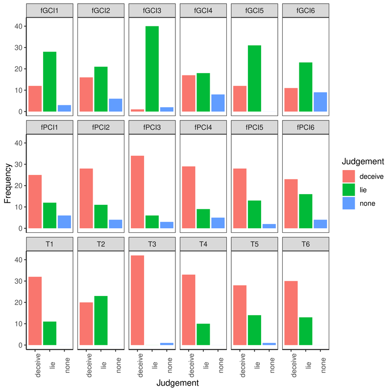

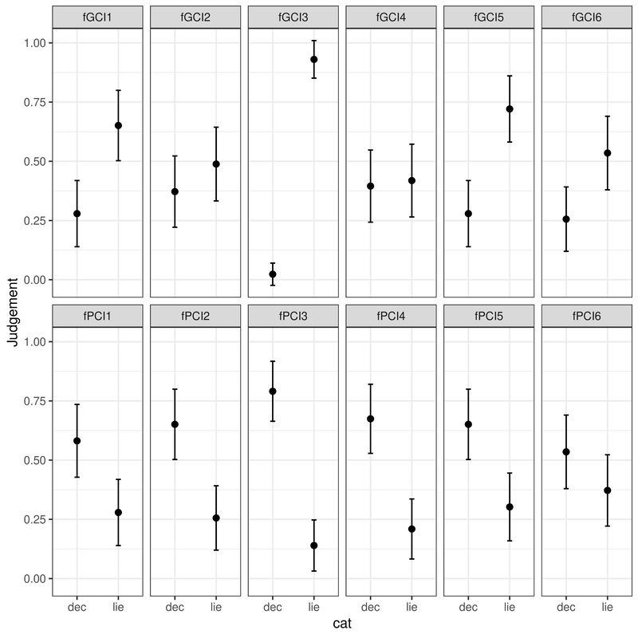

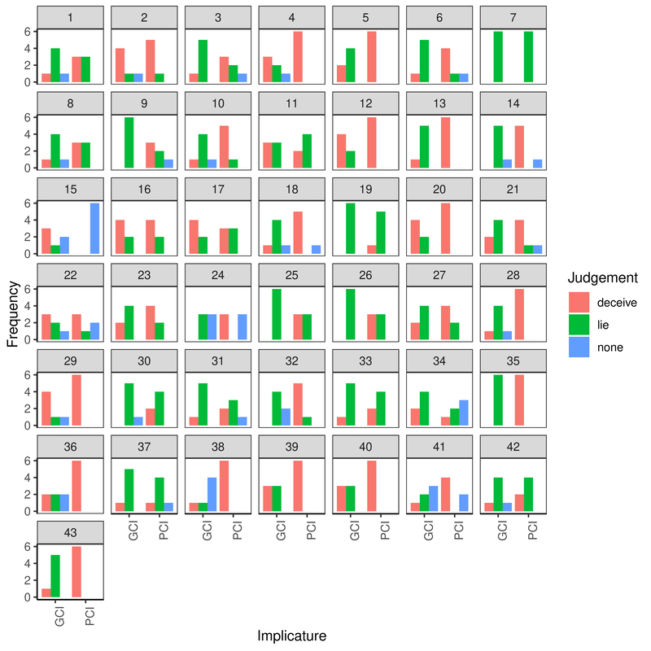

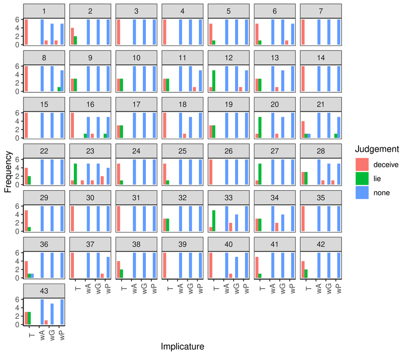

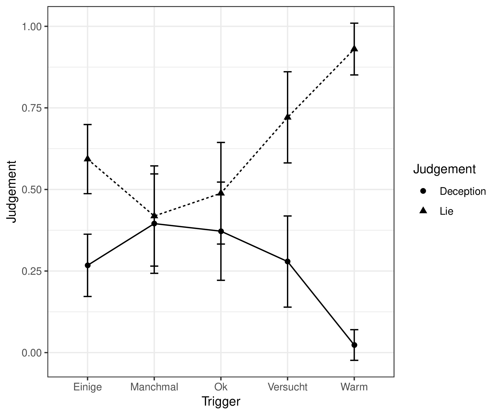

### Experiment 2: Chinese Participants

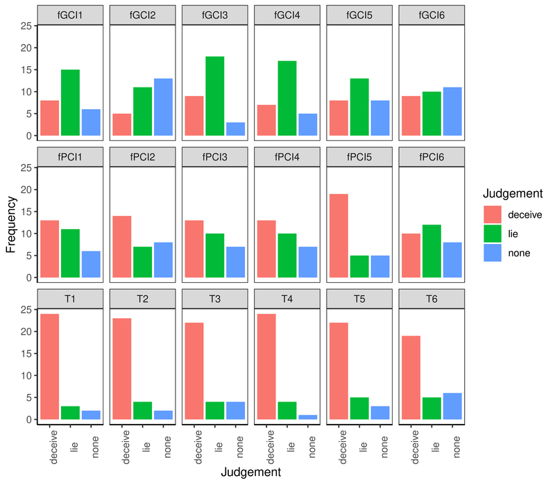

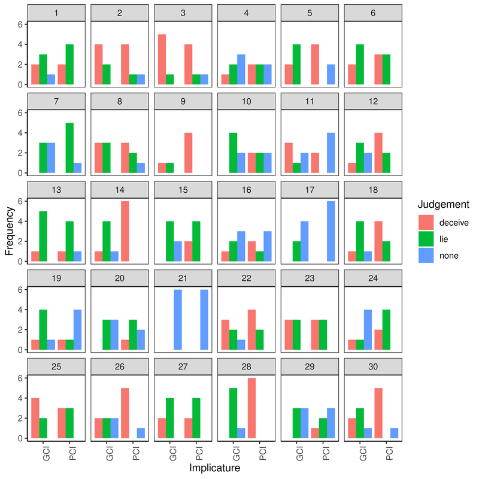

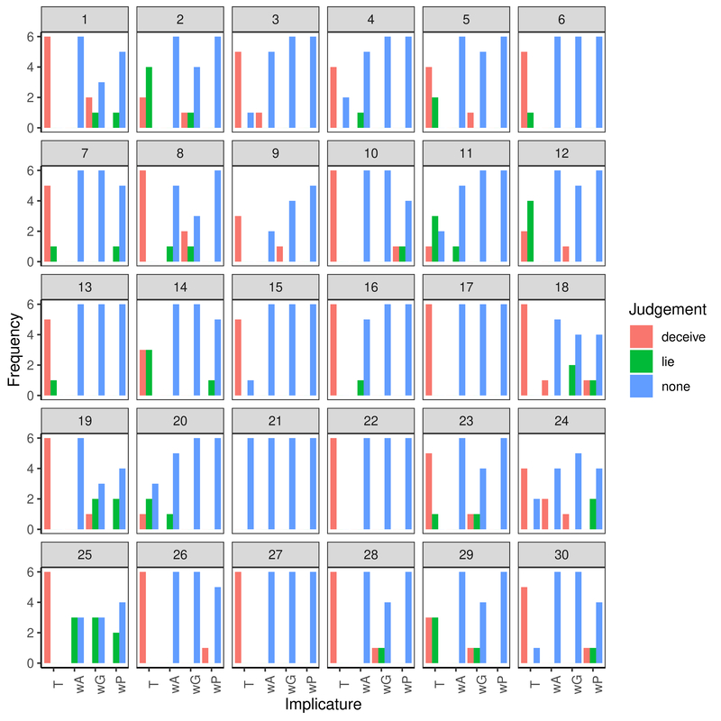

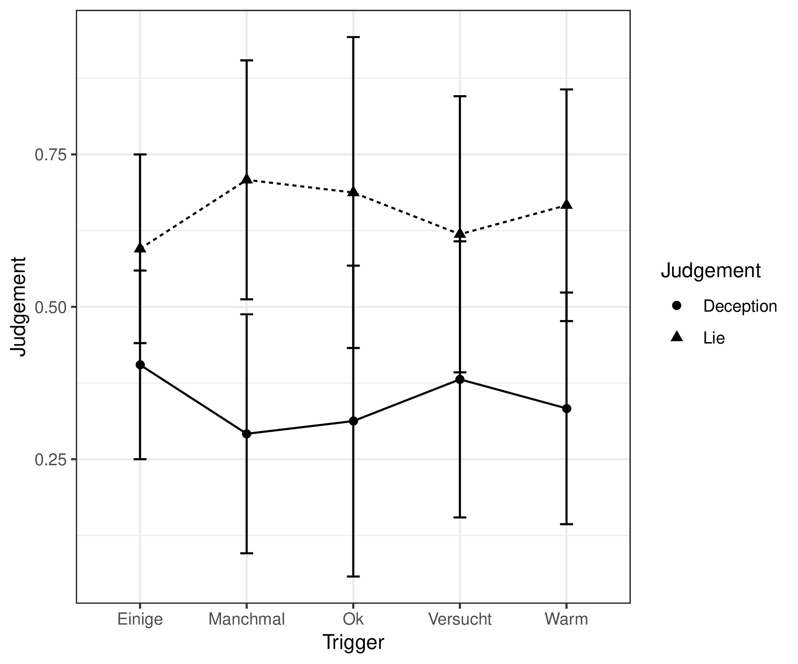

## Experiments 3 and 4: Moral Judgments

## Experiment 3: German Participants

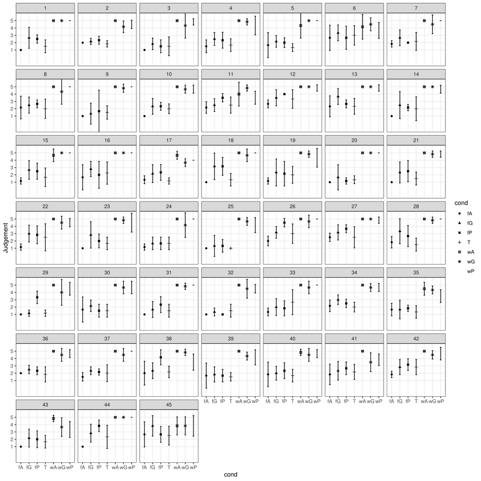

## Experiment 4: Chinese Participants

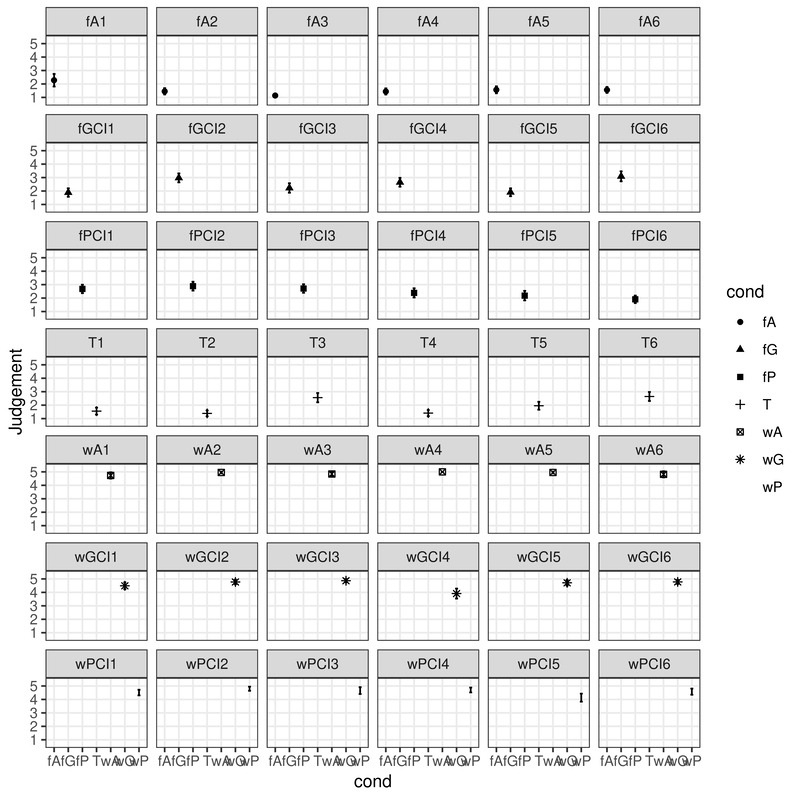

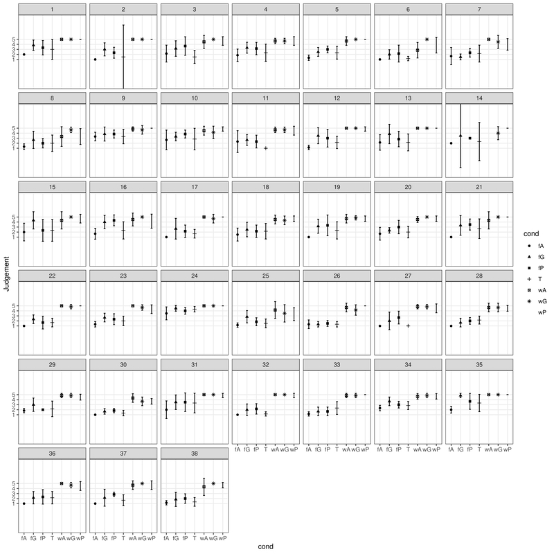
