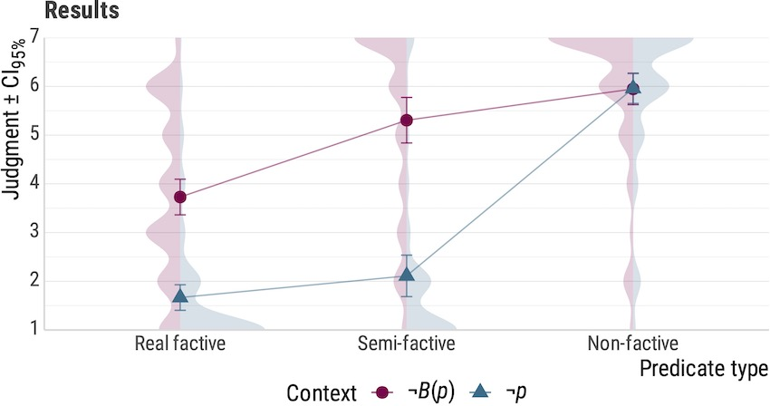

# No Hard Feelings, Karttunen: When Hard Presuppositions Project

by Maik Thalmann & Andrea Matticchio

2023 [LSA Summer Institute at UMass Amherst](https://blogs.umass.edu/lingstitute2023/) Poster

## Abstract

**On Non-Projecting Presuppositions** After the first works on presupposition triggers, it was noticed that not all presuppositional inferences behave the same: some of them can be canceled in specific contexts. For example, both *win* and
*too* normally come with an inference that projects past entailment-canceling operators, but only in the case of *win* can
this inference be canceled with an explicit ignorance statement. Similar contrasts have motivated a distinction between
soft and hard presupposition triggers (Abusch 2002).
A number of cases discussed in the literature where presuppositions seem not to project or arise concern factive
predicates, which normally seem to presuppose the truth of their complement. A heterogeneous group of verbs are
subsumed under this category since Kiparsky & Kiparsky (1970). Karttunen (1971) distinguished a subclass of semi-factive predicates, which can lose their factivity in contexts like questions, conditionals, or under modal operators.
Abrusán (2016) assimilates the distinction between semi-factives and real factives to the one between soft and hard
presupposition triggers. However, other works do not make a clear distinction between the two classes (Egré 2008),
also on the basis of the fact that the inference that the complement is true can be suspended in some cases even with
real factive verbs.

```
(1) John wrongly believes that Mary got married, and he regrets that she is no longer single. (Egré 2008: 14)
```

Karttunen (2016) tries to reconsider the entire class of factive verbs with the following conclusions: verbs of discovery (*discover*, *realize*) in principle do not require commitment of the speaker to the truth of the embedded proposition in
non-assertive contexts; with certain "robust" factives (*regret*, maybe *know*), the beliefs of the attitude holder are aligned
with the beliefs of the speaker in the absence of indication to the contrary as a generalized conversational implicature;
only certain predicates with *that*-clause subjects (*be odd*, *count*) are presupposition triggers.
In this poster, we present a pilot that explores a difference between verbs of discovery (semi-factives) and emotive
factives. Does the inference that the complement is true project more robustly for emotive factives out of the antecedent
of a conditional? We consider the hypothesis that verbs of discovery pattern with soft presupposition triggers and
emotive factives with hard presupposition triggers in this respect. The pattern, where a soft trigger and a semi-factive
are felicitous and where both *too* and *regret* lead to degradedness, is exemplified in (2).

```
(2) a.  I don't know whether the duck participated in a race, but if she won, she is probably drunk now.
    b.  I don't know whether the duck participated in a race, but if the panda discovers that she did, he will be furious.
    c. #I don't know whether anybody else was ill, but if the duck was ill too, she needed rest.
    d. #I don't know whether the panda is ill, but if the duck regrets that he is, she will bring him cookies.
```

**Experimental Evidence** An Acceptability Judgment Task (Likert scale from 1 to 7) in Italian (accessible here: <https://farm.pcibex.net/r/WWrlKZ/>) tested 28 participants (10 female; mean age 27.7, sd 2.9) in a 3 × 2 design: one
factor is **predicate** (real factive vs. semi-factive vs. non-factive; between items) and the other is **context** ($\neg p$ "not $p$"
vs. $\neg B(p)$ "I don't know whether $p$"; within items). A linear mixed model in R (version 4.2.2, R Core Team 2022; in
lme4, Bates et al. 2015) returns significant effects of both factors and significant interaction ($p< .001$) using likelihood
ratios; a post-hoc analysis of real factives and semi-factives returns a marginally significant interaction ($p < .051$).



**Discussion** The experimental evidence we provide supports a different treatment of verbs of discovery and emotive
factives, in line with the hypothesis that semi-factives are soft presupposition triggers, whereas emotive factives are hard
presupposition triggers.
We take issue with the claim by Karttunen (2016) that only predicates like *be odd* are really factive. On the basis of a
contrast like (3), we argue that a specific pattern of non-projection arises when a presupposition trigger interacts with
an attitude predicate and a context of mistaken belief, much like in Heim (1992). The source of non-projection cases
like (1) is the double nature of emotive factives as both presupposition triggers and attitude predicate.

```
(3) a. #Taro mistakenly believes that Eleni likes linguistics and it's awkward that she does.
    b.  Taro mistakenly believes that Eleni likes linguistics and he believes it's awkward that she does.
```
We also propose an extended version of the experiment where we test whether the difference between $\neg p$ and $\neg B(p)$
as a context for emotive factives can be replicated with hard (non-factive) presupposition triggers like *too*
or *again*. In addition to this, we also plan to test a contrast between presupposition failure and mistaken belief contexts
for the same factive predicates.

## References

- Abrusán, Márta. 2016. Presupposition cancellation: Explaining the ‘soft–hard' trigger distinction. Natural Language
Semantics 24(2). 165–202.
- Abusch, Dorit. 2002. Lexical alternatives as a source of pragmatic presuppositions. In Brendan Jackson (ed.), Proceedings
of Semantics and Linguistic Theory (SALT) 12, 1–19.
- Bates, Douglas, Martin Mächler, Ben Bolker & Steve Walker. 2015. Fitting linear mixed-effects models using lme4. Journal of Statistical Software 67(1). 1–48.
- Egré, Paul. 2008. Question-embedding and factivity. In F. Lihoreau (ed.), Grazer Philosophische Studien 77, 85–125. Amsterdam: Rodopi.
- Heim, Irene. 1992. Presupposition projection and the semantics of attitude verbs. Journal of Semantics (9). 183–221.
- Karttunen, Lauri. 1971. Some observations on factivity. Research on Language & Social Interaction 4(1). 55–69.
- Karttunen, Lauri. 2016. Presupposition: What went wrong? In Mary Moroney, Carol-Rose Little, Jacob Collard & Dan Burgdorf (eds.), Proceedings of Semantics and Linguistic Theory (SALT) 26, 705–731.
- Kiparsky, Paul & Carol Kiparsky. 1970. Fact. In M. Bierwisch & K.E. Heidolph (eds.), Progress in linguistics, 143–173. Hague: De Gruyter Mouton.
- R Core Team. 2022.R: A Language and Environment for Statistical Computing. R Foundation for Statistical Computing. Vienna, Austria.

-----

[Please get in touch!](mailto:maik.thalmann@gmail.com?cc=andreamatticchio@gmail.com)
